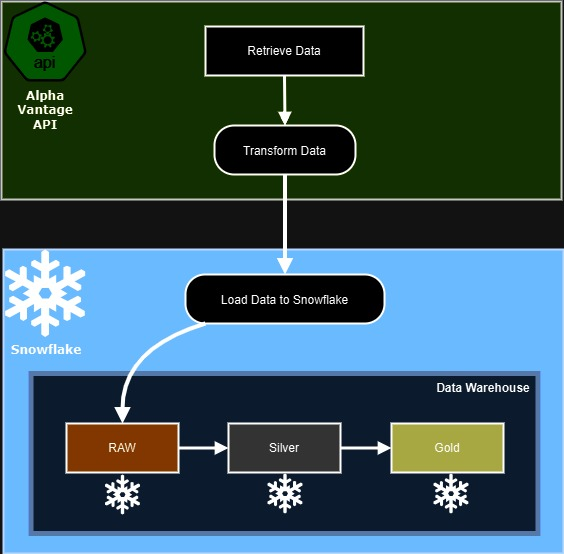

# Projeto End-To-End de Análise de Dados Financeiros do S&P500 com Snowflake (Medallion Architecture)

Este projeto é uma solução de análise de dados financeiros que utiliza Snowflake para ingestão, processamento e análise de dados de ações do mercado financeiro. Os dados são extraídos de uma API pública (Alpha Vantage) e organizados em três camadas principais: Bronze (Ingestão), Silver (Tratamento) e Gold (Análise).

## Estrutura do Projeto

### 1. Arquivo de Ingestão (`ingestao.py`)

- **Coletar dados**: Extrai dados financeiros da API pública Alpha Vantage com infos de algumas ações do S&P 500.
- **Armazenamento temporário**: Salva os dados coletados em uma tabela temporária no Snowflake.
- **Limitar a ingestão**: Garante que apenas as últimas 1000 linhas de dados sejam armazenadas, reduzindo custos e garantindo eficiência no armazenamento (Essa condição é usada apenas para teste)

### 2. Arquivo Silver (`silver_layer.py`)

- **Transformação dos dados**: Processa os dados brutos da tabela temporária, aplicando limpeza e transformação para torná-los mais utilizáveis.
- **Cálculo de métricas**: Cria colunas adicionais, como `avg_price` e `total_volume`, que são essenciais para análises futuras.
- **Armazenamento em Silver Layer**: Os dados tratados são armazenados em uma tabela `silver_finance_data` no Snowflake, prontos para análise mais aprofundada.

### 3. Arquivo Gold (`gold_layer.py`)

- **Análise avançada**: Realiza análises detalhadas sobre as ações mais negociadas, utilizando funções analíticas para calcular métricas como variação de preço e tendências.
- **Agregações e rankings**: Classifica as ações com base no volume total e calcula a média de preço e o desvio padrão dos preços ao longo de períodos definidos.
- **Criação da tabela de resultados**: Os resultados finais são armazenados na tabela `gold_finance_analytics`, prontos para serem utilizados em visualizações ou relatórios.
